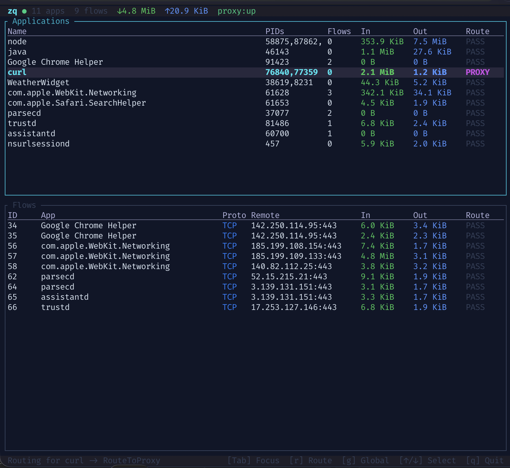

# Zinq

A macOS system proxy that monitors all application network traffic in real time, with selective routing to an HTTP proxy (Burp Suite, mitmproxy, Charles, etc.) for deeper investigation.

Single command. One screen. Everything visible.

```
sudo zq
```



The screen is split into two panels:

- **Applications** — one row per app, showing aggregate stats (total flows, bytes in/out) and the current routing rule (`PASS` or `PROXY`). This is where you control which apps get routed to your proxy.
- **Flows** — one row per individual TCP connection, showing the remote destination, protocol, and live byte counts. A single app may have many flows.

## Requirements

- macOS (no cross-platform support)
- Rust toolchain (`rustup`)
- Root privileges (for `/dev/pf` and `pfctl`)

## Install

```bash
git clone <repo-url> && cd zq
cargo build --release

# Copy binaries somewhere in $PATH
sudo cp target/release/zq target/release/zq-daemon /usr/local/bin/
```

## Usage

```bash
sudo zq
```

That's it. The TUI auto-launches the daemon, loads pf rules, and starts intercepting. Press `q` to quit — the daemon shuts down and pf rules are unloaded automatically.

If you're not root, it tells you:

```
zq: daemon is not running.

The daemon requires root privileges to intercept network traffic
(it needs access to /dev/pf and pfctl for packet redirection).

Run with: sudo zq
```

### Key Bindings

| Key | Action |
|-----|--------|
| `Tab` | Switch focus between Apps and Flows panels |
| `↑` / `↓` | Navigate in focused panel |
| `r` | Toggle routing for selected app (passthrough / proxy) |
| `g` | Toggle global routing for all apps |
| `q` | Quit (shuts down daemon, unloads pf rules) |

### Daemon Subcommands

The daemon can also be managed directly:

```bash
zq-daemon            # Run daemon in foreground
zq-daemon setup      # Load pf redirect rules
zq-daemon teardown   # Remove pf redirect rules
zq-daemon status     # Show system status
```

## Configuration

Config lives at `~/.zq/config`. Created with defaults on first run.

```
# zq configuration
proxy_addr = 127.0.0.1:8080     # upstream proxy address
interface = en0                  # network interface for pf rules
proxy_port = 8888                # local transparent proxy port
# socket_path = /tmp/zq-tui.sock
```

| Key | Default | Description |
|-----|---------|-------------|
| `proxy_addr` | `127.0.0.1:8080` | Address of the upstream HTTP proxy |
| `interface` | `en0` | Network interface for pf route-to rules |
| `proxy_port` | `8888` | Port the transparent proxy listens on |
| `socket_path` | `/tmp/zq-tui.sock` | Unix socket for daemon/TUI IPC |

Format is `key = value`, one per line. `#` comments. Unknown keys are ignored.

## How It Works

### Startup

1. `zq` checks if the daemon socket exists
2. If not running and you're root, it spawns `zq-daemon` in the background
3. Daemon opens `/dev/pf`, loads pf rules into anchor `zq`, starts listening
4. TUI connects to daemon over Unix socket, subscribes to live updates

### Traffic Interception

```
App traffic → pf rdr rule → zq transparent proxy (127.0.0.1:8888)
                                    │
                            DIOCNATLOOK → original destination
                            lsof → owning PID → app name/bundle
                            Hub → routing decision
                                    │
                        ┌───────────┴───────────┐
                    Passthrough              RouteToProxy
                   (direct connect)      (HTTP CONNECT tunnel
                                          to upstream proxy)
```

- pf `rdr` rules redirect TCP ports 80/443 through loopback to the proxy
- A `route-to` rule on the configured interface catches outbound traffic
- The daemon's own connections are excluded by UID to prevent loops
- For each connection, `DIOCNATLOOK` recovers the original destination
- Process resolution maps the source to an app name and bundle ID
- Byte counters update live (1-second intervals) via atomic counters

### Shutdown

Press `q` in the TUI. It sends a `Shutdown` command to the daemon, which:
1. Unloads pf rules from anchor `zq`
2. Restores `/etc/pf.conf`
3. Cleans up the socket file

Ctrl-C on the daemon also triggers clean shutdown.

## Architecture

```
crates/
  zq-proto/      Shared IPC types, length-prefixed codec, config
  zq-daemon/     Tokio async daemon
  zq/            Ratatui terminal UI
```

### IPC Protocol

Length-prefixed JSON over Unix sockets. Wire format: 4-byte LE u32 length + JSON payload.

**TUI → Daemon**: `Subscribe`, `GetState`, `SetAppRouting`, `SetGlobalRouting`, `Shutdown`

**Daemon → TUI**: `FullState`, `FlowUpdate`, `FlowRemoved`, `AppUpdate`, `ProxyStatusUpdate`

### Daemon Internals

- **Hub** (`hub.rs`) — Central state behind `Arc<Mutex<>>`. Single source of truth for flows, apps, routing rules, proxy status. Broadcasts updates to subscribed TUI clients.
- **Transparent proxy** (`proxy.rs`) — Accepts redirected connections, resolves original destination via pf, resolves owning process, bridges traffic with live byte counting.
- **Forwarder** (`forwarder.rs`) — Connects to the upstream proxy. HTTP CONNECT for TLS, direct forward for plain HTTP. Periodic health checks.
- **PF integration** (`pf.rs`) — Opens `/dev/pf`, manages anchor rules via `pfctl`, performs `DIOCNATLOOK` ioctls.
- **TUI server** (`tui_server.rs`) — Unix socket server, handles multiple simultaneous TUI clients.

## Development

```bash
cargo build          # build all crates
cargo test           # run tests (31 total)
cargo fmt            # format
cargo clippy         # lint

# or use the Makefile
make build
make test
make run             # sudo cargo run --bin zq
```

## License

MIT
